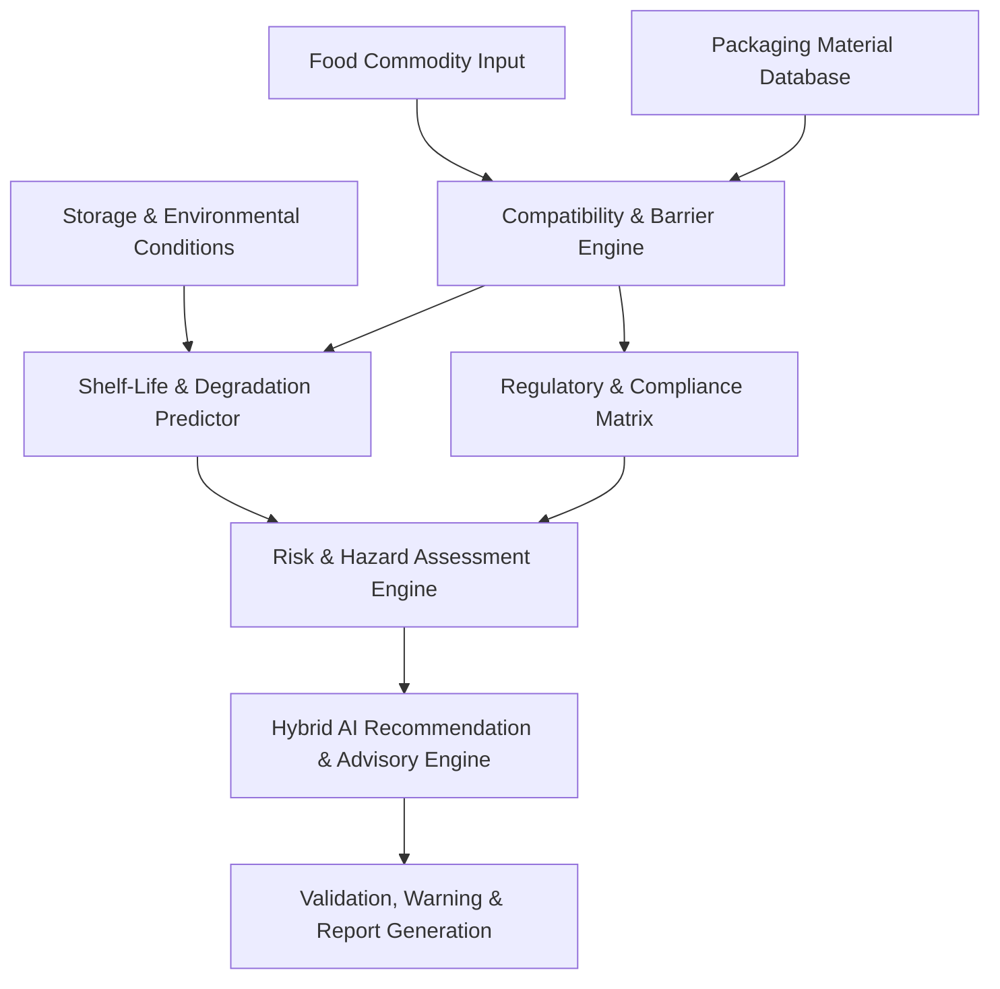
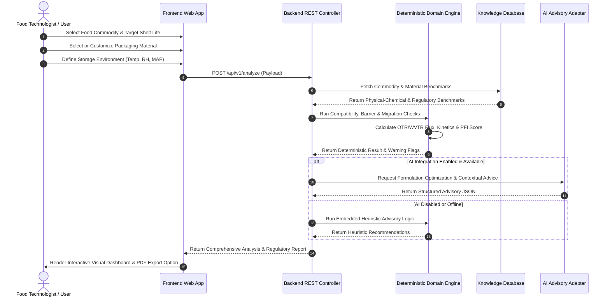
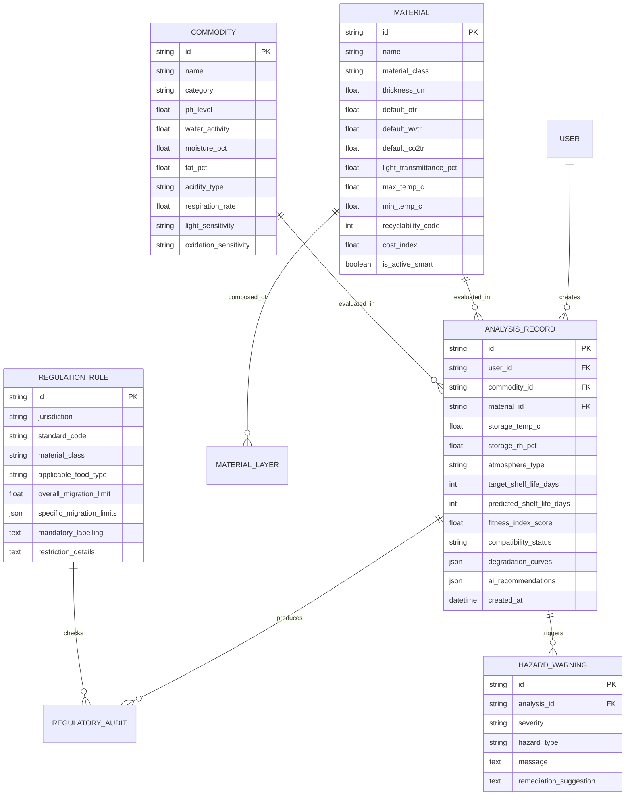
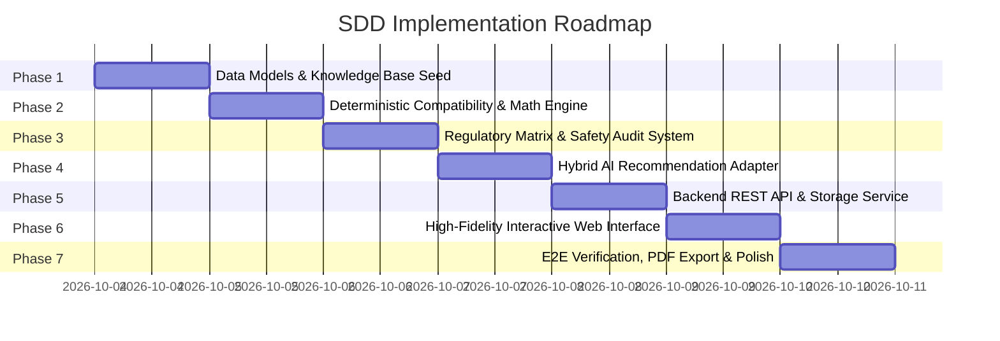

# PackSmart: AI-Based Intelligent Food Packaging Material and Regulatory System for Food Commodities
## Master Project Specification (Spec-Driven Development — Single Source of Truth)

**Document Version:** 1.0.0  
**Status:** Approved Specification  
**Architecture Paradigm:** Domain-Driven Design (DDD) with Deterministic Regulatory Engine & Hybrid AI Recommendation Adapter  

---

## 1. Project Objective and Problem Statement

### 1.1 Problem Statement
The modern food processing and packaging industry faces multifaceted challenges in selecting appropriate packaging systems:
- **Food Spoilage and Shelf-Life Losses:** Incompatible packaging materials fail to maintain optimal gas barriers ($O_2, CO_2, H_2O$), leading to premature oxidation, microbial spoilage, moisture gain/loss, and loss of organoleptic quality.
- **Regulatory Complexity and Non-Compliance:** Navigating divergent food safety and food contact materials (FCM) regulations (such as FSSAI, US FDA 21 CFR, EU Regulations 1935/2004 & 10/2011, and Codex Alimentarius) is labor-intensive, error-prone, and exposes manufacturers to severe recall and legal liabilities.
- **Toxicological and Chemical Hazards:** Chemical migration from polymers, plasticizers, printing inks, and Non-Intentionally Added Substances (NIAS) into fatty, acidic, or high-moisture foods poses acute and chronic consumer health risks.
- **Sustainability vs. Performance Trade-offs:** Transitioning from multi-layer fossil-based plastics to biodegradable/compostable polymers (e.g., PLA, PHA, cellulose) often fails due to inadequate knowledge regarding gas permeation, mechanical seal strength, and thermal resistance.

### 1.2 Project Objective
**PackSmart** is an intelligent, domain-grounded software platform designed to evaluate, recommend, validate, and audit packaging materials for diverse food commodities. 

The system provides:
1. **Deterministic Scientific Calculation:** Accurate calculation of barrier requirements, moisture sorption, lipid oxidation risks, and shelf-life predictions based on empirical food science models.
2. **Deterministic Regulatory Verification:** Rule-based compliance checks against global food contact material frameworks (FSSAI, US FDA, EU FCM).
3. **AI-Assisted Formulation & Optimization:** Safe, advisory-level contextual recommendations for sustainable alternatives, barrier enhancement coatings, and cost-effective multi-layer structures.
4. **Comprehensive Safety Auditing:** Automated detection of migration risks, acidic corrosion, fat scalping, stress cracking, and labeling requirements.

---

## 2. Target Users and User Roles

### 2.1 User Personas
- **Food Technologists & Packaging Engineers:** Formulating new products, specifying barrier requirements, and choosing mono- vs multi-layer laminates.
- **Quality Assurance & Regulatory Compliance Officers:** Verifying compliance with migration limits, food contact declarations, toxicological safety, and mandatory consumer labeling.
- **R&D Specialists & Sustainability Consultants:** Exploring biopolymers, recyclable mono-materials, and active/smart packaging systems.
- **Food Processing SMEs & Manufacturers:** Seeking rapid, validated packaging recommendations without expensive recurring laboratory pre-screening.

### 2.2 Role-Based Access Control (RBAC)

| Role | Permissions | Access Scope |
|---|---|---|
| **Guest / Public Viewer** | Run single-sample compatibility checks, view public material specifications, view basic regulatory summaries. | Read-only access to standard commodity database and basic calculation tools. |
| **Packaging Technologist** | Full access to packaging analysis engine, shelf-life estimator, custom food commodity profile creation, material comparison matrices, and exportable technical sheets. | Workspace project creation, draft analysis saving, custom parameters tuning. |
| **Regulatory & QA Auditor** | Full technologist privileges + regulatory compliance override reviews, migration limit threshold configuration, audit log inspection, formal compliance report generation (PDF/JSON). | Organizational compliance datasets, audit trails, and certification flags. |
| **System Administrator** | User management, regulatory standard versioning updates, baseline material property catalog management, AI model configuration and prompt template maintenance. | Global system settings, database migration tools, API key management, audit logs. |

---

## 3. Core Functional Domains & Modules



### 3.1 Module Breakdown
1. **Food Commodity Profiler:** Ingestion and characterization of intrinsic food properties.
2. **Packaging Material Catalog:** Comprehensive physical, mechanical, thermal, and barrier property specifications.
3. **Food-Packaging Compatibility Engine:** Multi-factor physical-chemical interaction matrix.
4. **Storage & Shelf-Life Estimation Engine:** Kinetic decay, moisture sorption isotherm, gas transmission, and Arrhenius temperature modeling.
5. **Food Safety & Hazard Analysis Engine:** Overall migration limit (OML), specific migration limit (SML), NIAS risk, and allergen cross-contact evaluation.
6. **Regulatory Compliance Engine:** Multi-jurisdiction rules matrix (FSSAI, FDA, EU, Codex).
7. **AI-Assisted Advisory System:** LLM/heuristic reasoning for smart trade-offs, sustainable alternatives, and packaging optimization.
8. **Audit & Reporting Engine:** Dynamic visual dashboard, warning matrix, and exportable compliance certificates.

---

## 4. Detailed Domain Requirements

### 4.1 Food Commodity Input Specifications
The system must support structured categorization across primary food classes with precise physical-chemical parameters:

#### 4.1.1 Food Categories
- **Fresh Produce:** Fruits, vegetables, fresh-cut greens (requires respiration rate $R_{O_2}, R_{CO_2}$, ethylene sensitivity).
- **Dairy Products:** Liquid milk, cheese, butter, yogurt, milk powder (moisture, fat content, light sensitivity, microbial risk).
- **Bakery & Confectionery:** Bread, biscuits, cakes, chocolates (water activity $a_w$, crispness threshold, fat oxidation, moisture uptake).
- **Meat, Poultry & Seafood:** Fresh meat, processed meats, frozen fish (color stability, myoglobin state, high $a_w$, proteolytic microbial spoilage).
- **Fats & Oils:** Vegetable oils, ghee, mayonnaise (lipid rancidity, peroxide value index, oxygen & light sensitivity).
- **Beverages & Liquid Foods:** Juices, carbonated soft drinks, alcoholic beverages, tea/coffee (acidity/pH, carbonation retention, aroma loss).
- **Dry Foods, Grains & Pulses:** Cereals, flour, pulses, spices (hygroscopicity, insect infestation, volatile essential oil retention).
- **Processed & Ready-to-Eat (RTE):** Retort pouches, canned foods, frozen meals (thermal processing resistance, seal integrity under pressure).

#### 4.1.2 Required Commodity Parameter Schema
- `commodity_id`: Unique identifier (e.g., `COMM-DAIRY-001`).
- `name`: Common food name (e.g., "Full Cream Milk Powder").
- `category`: Classification enum.
- `physical_state`: Solid, Liquid, Semi-Solid, Powder, Viscous.
- `ph_level`: Floating value between $1.0$ and $14.0$.
- `water_activity_aw`: Value between $0.00$ and $1.00$.
- `moisture_content_pct`: Percentage by weight ($0.0\%$ - $100.0\%$).
- `fat_lipid_content_pct`: Percentage by weight ($0.0\%$ - $100.0\%$).
- `acidity_type`: Non-acid ($pH > 4.6$), High-acid ($pH \le 4.6$), Citric, Acetic, Lactic, etc.
- `respiration_rate`: For produce — $mg\ CO_2 / kg \cdot h$ at reference temperature.
- `ethylene_sensitivity`: High, Medium, Low, None.
- `light_sensitivity`: Critical, High, Moderate, Low.
- `oxidation_sensitivity`: High (Unsaturated fats), Moderate, Low.
- `target_shelf_life_days`: Desired shelf life under defined storage.

---

### 4.2 Packaging Material Catalog Specifications
The system must maintain an extensible catalog of food contact materials, including polymers, bio-based films, metallic foils, glass, paperboards, and smart/active systems.

#### 4.2.1 Material Classes & Types
1. **Conventional Thermoplastics:**
   - **LDPE / LLDPE:** High flexibility, excellent moisture barrier, high gas permeability, heat sealable.
   - **HDPE:** High moisture barrier, moderate gas barrier, rigid, chemical resistance.
   - **PP (Cast PP, BOPP):** High thermal resistance (retortable), good moisture barrier, clarity, flex-crack resistance.
   - **PET (BOPET):** High tensile strength, good aroma and gas barrier, clarity, printable.
   - **PVC / PVDC:** High gas/moisture barrier coating (with strict migration considerations).
   - **EVOH:** Ultra-high oxygen barrier (hydrophilic; requires moisture protection layer).
   - **Polyamide (PA / Nylon):** Puncture resistance, thermoformability, moderate gas barrier.
2. **Sustainable & Bio-based Polymers:**
   - **PLA (Polylactic Acid):** High clarity, rigid, high gas/moisture permeability, industrially compostable.
   - **PHA / PHB:** Bio-based, biodegradable in soil/marine, moderate water barrier.
   - **Cellulose / Cellophane:** Clear, high oxygen barrier at low RH, requires moisture barrier coatings.
   - **Thermoplastic Starch (TPS):** Blended biodegradable formulations.
3. **Multi-layer Laminates & High-Barrier Substrates:**
   - E.g., `PET / AL / LLDPE` (Aseptic/Retort foil pouches).
   - E.g., `BOPP / Metalized BOPP / Cast PP` (Snack packaging).
   - E.g., `PA / EVOH / PE` (Vacuum MAP barrier films).
4. **Non-Polymeric FCMs:**
   - **Aluminum Foil:** Absolute barrier to light, gas, moisture, aroma (pinhole risks at low gauge).
   - **Tinplate / ECCS Steel:** Canned foods (requires BPA-free internal epoxy/polyester lacquer validation).
   - **Glass (Soda-lime):** Absolute chemical barrier, hermetic, recyclable (fragility & thermal shock limitations).
   - **Paper & Paperboard:** Kraft, duplex, solid bleached sulfate (SBS) (requires food-grade barrier coatings to prevent mineral oil saturated hydrocarbon [MOSH/MOAH] migration).
5. **Active & Intelligent Packaging Elements:**
   - Scavengers: $O_2$ scavengers (iron/ascorbic acid), ethylene scrubbers ($KMnO_4$).
   - Moisture Regulators: Silica gel, desiccant clay, humidity-controlling films.
   - Emitters: $CO_2$ emitters, essential oil antimicrobial vapor emitters.
   - Indicators: Time-Temperature Indicators (TTI), freshness colorimetric pH indicators.

#### 4.2.2 Key Material Properties (Quantitative & Qualitative)
- `material_id`: Unique identifier (e.g., `MAT-POLY-004`).
- `name` and `commercial_designation`: String.
- `class`: Monopolymer, Bio-polymer, Multi-layer Laminate, Metal, Glass, Paperboard, Active.
- `thickness_microns`: Default gauge (e.g., $12 \mu m, 25 \mu m, 70 \mu m$).
- `otr`: Oxygen Transmission Rate ($cm^3 / m^2 \cdot day \cdot atm$ at $23^\circ C, 0\% / 50\% RH$).
- `wvtr`: Water Vapor Transmission Rate ($g / m^2 \cdot day$ at $38^\circ C, 90\% RH$).
- `co2tr`: Carbon Dioxide Transmission Rate ($cm^3 / m^2 \cdot day \cdot atm$).
- `light_transmittance_pct`: Transmittance ($200-800 nm$).
- `max_temperature_celsius`: Maximum safe thermal threshold (e.g., microwavable $120^\circ C$, retort $121-135^\circ C$, hot fill $85-95^\circ C$).
- `min_temperature_celsius`: Glass transition / embrittlement temperature (e.g., deep freeze $-40^\circ C$).
- `tensile_strength_mpa`: Mechanical strength metric.
- `seal_strength_n_per_15mm`: Heat seal integrity metric.
- `grease_resistance_kit_rating`: Rating $1-12$ or solvent barrier.
- `recyclability_code`: SPI Resin code 1-7 or compostability standard (EN 13432 / ASTM D6400).
- `cost_index`: Relative cost rating ($1.0 - 5.0$).

---

### 4.3 Food-Packaging Compatibility Analysis Engine
The system executes a deterministic multi-dimensional matrix check to identify physical, chemical, and biological incompatibilities:

1. **Acidity & Corrosion Check:**
   - Condition: If Food $pH < 4.5$ and Material is Uncoated Metal/Aluminum $\rightarrow$ **CRITICAL INCOMPATIBILITY** (Acidic pitting and metallic ion migration). Internal lacquering required.
2. **Lipid & Grease Resistance:**
   - Condition: If Food Fat $> 15\%$ and Material is Non-Polar Thin Polyolefin (e.g., standard LDPE) without barrier $\rightarrow$ **WARNING** (Grease permeation, environmental stress cracking, swelling, and flavor scalping).
3. **Moisture Sorption / Loss Dynamics:**
   - Condition: If Food $a_w < 0.3$ (hygroscopic dry food) and Material $WVTR > 2.0\ g/m^2 \cdot day$ $\rightarrow$ **WARNING** (Loss of crispness, caking).
   - Condition: If Food $a_w > 0.85$ (high moisture) and Material is non-barrier paper or hydrophilic film (uncoated cellophane/EVOH outer) $\rightarrow$ **CRITICAL** (Loss of barrier, mold growth).
4. **Oxygen Sensitivity & Lipid Oxidation:**
   - Condition: If Food Oxidation Sensitivity is "High" and Packaging $OTR > 15\ cm^3/m^2 \cdot day \cdot atm$ $\rightarrow$ **WARNING** (Rancidity, hexanal buildup, degradation of fat-soluble vitamins A, D, E).
5. **Light Degradation:**
   - Condition: If Food Light Sensitivity is "Critical" (e.g., virgin olive oil, beer, milk) and Material Light Transmittance $> 5\%$ $\rightarrow$ **WARNING** (Photo-oxidation, riboflavin breakdown, off-flavor "skunking"). Amber, UV-stabilized, or foil/metallized layers required.
6. **Thermal Processing Compatibility:**
   - Condition: If process involves Retort Autoclave ($121^\circ C$) and Material Max Temp $< 125^\circ C$ $\rightarrow$ **CRITICAL** (Polymer melting, package structural failure, toxic delamination).
   - Condition: If Frozen Storage ($-20^\circ C$) and Material Min Temp $> -10^\circ C$ $\rightarrow$ **WARNING** (Embrittlement, micro-crack formation, loss of hermetic seal).
7. **Flavor Scalping & Aroma Transmission:**
   - Evaluation of volatile flavor compound absorption (e.g., d-limonene absorption in polyolefins).

---

### 4.4 Storage Conditions & Shelf-Life Estimation Engine
The system must calculate and project degradation timelines across distinct supply chain storage modes:

#### 4.4.1 Storage Regimes
- **Ambient Storage:** $25^\circ C \pm 2^\circ C$, $60\% \pm 5\% RH$.
- **Accelerated Shelf-Life Testing (ASLT):** $40^\circ C \pm 2^\circ C$, $75\% \pm 5\% RH$.
- **Refrigerated / Cold Chain:** $4^\circ C \pm 2^\circ C$, $85\% \pm 5\% RH$.
- **Frozen Storage:** $-18^\circ C$ to $-25^\circ C$.
- **Modified Atmosphere Packaging (MAP):** Target gas headspace composition (e.g., $70\%\ N_2 / 30\%\ CO_2$ or $80\%\ O_2 / 20\%\ CO_2$).

#### 4.4.2 Mathematical Modeling Foundations
1. **Moisture Transfer Rate through Barrier:**
   $$\frac{dw}{dt} = \frac{WVTR \cdot A}{100}$$
   Predicts days until critical moisture threshold $m_c$ is reached from initial moisture $m_i$.
2. **Oxygen Ingress & Oxidation Kinetics:**
   $$\frac{d[O_2]}{dt} = \frac{OTR \cdot A \cdot (P_{ext} - P_{int})}{V_{headspace}}$$
   Coupled with first-order or zero-order oxidation degradation constant $k$.
3. **Arrhenius Temperature Dependence:**
   $$k(T) = k_0 \cdot \exp\left(-\frac{E_a}{R \cdot T}\right)$$
   Or $Q_{10}$ model for temperature abuse shelf-life recalculation ($Q_{10} = 2.0 - 3.5$).
4. **Produce Equilibrium MAP Respiration Equation:**
   $$R_{O_2} \cdot W = \frac{OTR \cdot A}{L} \cdot (y_{O_2, ext} - y_{O_2, pkg})$$

---

### 4.5 Food Safety, Hazard Analysis, and Risk Assessment
The system must generate a structured risk assessment report based on HACCP principles and chemical migration physics:

1. **Overall Migration Limit (OML) Verification:**
   - Standard EU/FSSAI Limit: $10\ mg/dm^2$ or $60\ mg/kg$ food stimulant.
   - Simulation media matching:
     - Aqueous/Acidic foods $\rightarrow 3\%$ Acetic Acid (Simulant B).
     - Alcoholic foods $\rightarrow 10\% - 20\%$ Ethanol (Simulant C).
     - Fatty foods $\rightarrow$ Olive Oil / Isooctane / $95\%$ Ethanol (Simulants D1, D2).
     - Dry foods $\rightarrow$ Poly(2,6-diphenyl-p-phenylene oxide) / Tenax (Simulant E).
2. **Specific Migration Limits (SML) & Toxic Substances:**
   - Phthalates (DEHP, DBP, DINP) and plasticizers.
   - Primary Aromatic Amines (PAAs) from polyurethane adhesives in multi-layer laminates ($< 0.01\ mg/kg$).
   - Bisphenol compounds (BPA, BPS, BPF) in can linings.
   - Heavy metals (Lead, Cadmium, Mercury, Hexavalent Chromium $< 100\ ppm$ combined in packaging).
   - Formaldehyde and Melamine from amino resins.
3. **Non-Intentionally Added Substances (NIAS):**
   - Oligomers, breakdown products, catalyst residues, printing ink photoinitiators (e.g., Benzophenone, ITX).
4. **Physical Hazard Risks:**
   - Pin-hole formation in thin metalized films.
   - Delamination of adhesive-laminated pouches.
   - Puncture risk from sharp food edges (e.g., bone-in meats, dry pasta).

---

### 4.6 Regulatory Compliance Guidance Engine
The system must maintain rule-based regulatory mapping across major jurisdictions:

| Jurisdiction | Primary Standards & Laws | Key Compliance Rules |
|---|---|---|
| **India (FSSAI)** | Food Safety and Standards (Packaging) Regulations, 2018; IS 9845, IS 10146, IS 10142, IS 12252. | Mandatory migration testing per IS standards; ban on recycled plastics for direct food contact (unless explicitly certified food-grade rPET under 2022 notification); mandatory veg/non-veg logo area; printing ink heavy metal limits (IS 15495). |
| **USA (US FDA)** | 21 CFR Parts 174–178 (Indirect Food Additives: Polymers, Adhesives, Coatings). | Food Contact Notification (FCN) inventory; GRAS substances; extraction thresholds; functional barrier exemption rules. |
| **European Union (EU)** | Regulation (EC) No 1935/2004 (Framework), Commission Regulation (EU) No 10/2011 (Plastics FCM), Regulation (EC) No 2023/2006 (GMP). | Positive Union List of authorized monomers & additives; Declaration of Compliance (DoC) requirements; SML thresholds; dual-use additive disclosures. |
| **Codex Alimentarius** | CAC/RCP 1-1969, CODEX STAN 1-1985 (General Standard for the Labelling of Prepackaged Foods). | International baseline food hygiene, migration prevention, and packaging labeling guidelines. |

---

### 4.7 AI-Assisted Recommendation & Advisory System
The AI module serves as an **intelligent synthesizer, optimization engine, and conversational advisor**. It does not replace deterministic safety rules, but works alongside them in a **Hybrid Architecture**:

1. **Role of AI in PackSmart:**
   - **Optimization of Multi-Layer Film Formulations:** Suggesting minimal gauge thickness that meets barrier criteria while reducing carbon footprint and material cost.
   - **Sustainable Material Alternative Synthesis:** Evaluating drop-in bio-polymer replacements (e.g., replacing PET/PE with PLA/PBS or coated cellulose) and pointing out barrier shortfalls that require active agents.
   - **Natural Language Regulatory Guidance:** Synthesizing complex regulatory clauses into plain-language actionable checklists for QA teams.
   - **Anomaly Explanation:** Generating detailed scientific explanations when a deterministic rule flags a compatibility hazard.
2. **AI Guardrails & Fallback Mechanisms:**
   - **Deterministic Pre- & Post-Filtering:** The deterministic engine runs *before* the AI to establish inviolable safety/regulatory boundaries.
   - **Offline / Zero-API-Key Fallback Heuristic Engine:** If no external AI API key is configured or the service is unreachable, the system seamlessly falls back to an embedded deterministic rule-based advisory engine.
   - **Structured Schema Enforcement:** AI outputs must strictly adhere to a JSON schema validated via schema parsers (e.g., Zod / Pydantic).

---

### 4.8 Warning, Validation, and Scoring System

#### 4.8.1 Compatibility & Safety Index (0 to 100 Score)
The system computes an overall **Packaging Fitness Index (PFI)**:
$$\text{PFI} = 0.35 \times C_{\text{compat}} + 0.30 \times S_{\text{shelflife}} + 0.20 \times R_{\text{regulatory}} + 0.15 \times E_{\text{eco}}$$

Where:
- $C_{\text{compat}}$: Chemical & physical compatibility score ($0-100$).
- $S_{\text{shelflife}}$: Target vs. calculated shelf-life achievement score ($0-100$).
- $R_{\text{regulatory}}$: Regulatory compliance pass rate ($0$ if any critical regulatory ban is violated, otherwise $100$).
- $E_{\text{eco}}$: Recyclability, biodegradability, and material efficiency score ($0-100$).

#### 4.8.2 Warning Severity Levels

| Severity Level | Color Code | Condition Example | System Action |
|---|---|---|---|
| **CRITICAL DANGER (Level 3)** | Red / `#EF4444` | Acidic food in unlacquered tin; toxic migration risk; banned FCM. | Disqualifies combination; blocks recommendation; flags immediate rejection. |
| **HIGH WARNING (Level 2)** | Amber / `#F59E0B` | Inadequate oxygen barrier causing $50\%$ reduction in target shelf life; grease scalping. | Issues prominent warning banner; suggests high-barrier lamination or $O_2$ scavenger. |
| **ADVISORY (Level 1)** | Blue / `#3B82F6` | Non-optimal recyclability; mono-material alternative available at lower cost. | Provides advisory recommendation in optimization panel. |
| **PASSED / OPTIMAL (Level 0)**| Green / `#10B981`| All barrier, regulatory, mechanical, and safety criteria fully satisfied. | Verified checkmark badge with full compliance report. |

---

## 5. Technical Architecture & System Design

### 5.1 System Technology Stack
- **Frontend Presentation Layer:**
  - Modern Single Page Application (React / Next.js / Vite SPA).
  - High-performance Vanilla CSS with a centralized Design Token System (Dark/Light mode support, glassmorphism, responsive grid, accessible typography).
  - Dynamic Data Visualizations: Interactive barrier charts, shelf-life degradation curves, radar charts for fitness metrics.
- **Backend Application Layer:**
  - Node.js (Express / Fastify) or Python (FastAPI).
  - Strict Layered Architecture: `Controllers` $\rightarrow$ `Services` $\rightarrow$ `Domain Engines` $\rightarrow$ `Repositories` $\rightarrow$ `AI Adapter`.
- **Database & Storage Layer:**
  - SQLite (with WAL mode) or PostgreSQL for relational data integrity.
  - ORM / Query Builder: Prisma / SQLAlchemy / Drizzle.
  - Embedded Seed Datasets: 50+ standardized food commodities, 30+ packaging materials, comprehensive regulatory limits database.
- **AI Integration Layer:**
  - Gemini / Open-source LLM Adapter with prompt engineering templates and structured JSON responses.
  - Local heuristic fallback engine for deterministic standalone offline operation.

---

### 5.2 System Data Flow Diagram



---

## 6. Database Schema & Data Models

### 6.1 Entity-Relationship Diagram (ERD)



---

## 7. RESTful API Specifications

### 7.1 Endpoints Overview

#### 1. Commodities & Materials Catalog
- `GET /api/v1/commodities`: List all commodities with filtering by category and sensitivity.
- `GET /api/v1/commodities/:id`: Retrieve detailed parameters for a single commodity.
- `POST /api/v1/commodities`: Create custom commodity profile (authenticated).
- `GET /api/v1/materials`: List all packaging materials with barrier metrics and recyclability filter.
- `GET /api/v1/materials/:id`: Retrieve comprehensive technical datasheet for a material.
- `POST /api/v1/materials`: Register custom multi-layer or novel packaging material.

#### 2. Analysis & Compatibility Engine
- `POST /api/v1/analyze`:
  - **Request Body:**
    ```json
    {
      "commodity_id": "COMM-DAIRY-001",
      "custom_commodity_overrides": null,
      "material_id": "MAT-LAMINATE-003",
      "custom_material_layers": [
        {"material_code": "BOPET", "thickness_um": 12},
        {"material_code": "AL_FOIL", "thickness_um": 9},
        {"material_code": "LLDPE", "thickness_um": 50}
      ],
      "storage_conditions": {
        "temperature_c": 25.0,
        "relative_humidity_pct": 65.0,
        "atmosphere": "MAP_NITROGEN_FLUSH",
        "map_gas_ratio": {"o2": 0.5, "co2": 0.0, "n2": 99.5},
        "target_shelf_life_days": 180
      },
      "jurisdictions": ["FSSAI", "FDA", "EU"]
    }
    ```
  - **Response Body:**
    ```json
    {
      "analysis_id": "ANALYSIS-9842-X",
      "timestamp": "2026-10-03T12:00:00Z",
      "compatibility_status": "COMPATIBLE_WITH_CONDITIONS",
      "fitness_index_score": 92.5,
      "scores": {
        "compatibility": 95.0,
        "shelf_life": 90.0,
        "regulatory": 100.0,
        "sustainability": 80.0
      },
      "predicted_shelf_life_days": 195,
      "limiting_failure_mode": "LIPID_OXIDATION_SECONDARY",
      "warnings": [
        {
          "id": "WARN-01",
          "severity": "ADVISORY",
          "category": "SUSTAINABILITY",
          "message": "Foil layer is non-recyclable in standard municipal streams.",
          "remediation": "Consider high-barrier AlOx-coated PET mono-material structure for 100% recyclability."
        }
      ],
      "regulatory_compliance": {
        "FSSAI": {"status": "COMPLIANT", "standards": ["IS 9845", "IS 10146"], "notes": "Passes overall migration limits."},
        "FDA": {"status": "COMPLIANT", "standards": ["21 CFR 177.1520"], "notes": "Food Contact Notification valid."},
        "EU": {"status": "COMPLIANT", "standards": ["Regulation (EU) No 10/2011"], "notes": "DoC required for adhesive layer."}
      },
      "ai_advisory": {
        "summary": "The proposed 3-ply foil laminate provides exceptional oxygen and moisture barriers, surpassing the 180-day target shelf life for whole milk powder.",
        "optimization_suggestions": [
          "Down-gauge LLDPE from 50µm to 40µm with metallocene PE to save 12% material weight without compromising seal strength.",
          "Alternative bio-barrier: Evaluate metallized PLA + PBS sealant for biodegradable applications."
        ],
        "safe_handling_tips": "Ensure pouch seal temperature is maintained at 165°C to avoid micro-channel leaks."
      }
    }
    ```

#### 3. Material Recommendation & Search
- `POST /api/v1/recommend`: Recommends top matching packaging materials based on commodity requirements, target shelf life, budget, and sustainability targets.

#### 4. Compliance & Audit Reports
- `GET /api/v1/reports/:analysis_id/export?format=pdf|json|csv`: Generates and exports certified technical compliance audit report.

---

## 8. Frontend User Experience & Visual Design Requirements

### 8.1 Aesthetic & Visual Standards
- **Color Palette:**
  - Canvas Background (Dark Mode): `#0B0F19` (Deep Obsidian / Midnight).
  - Surface Cards: `#131B2E` with subtle glassmorphic backdrop filter (`backdrop-filter: blur(12px)` and `1px solid rgba(255,255,255,0.08)`).
  - Primary Accent: `#38BDF8` (Cyan/Sky Electric).
  - Secondary Accent: `#818CF8` (Indigo Glow).
  - Success/Safety Accent: `#10B981` (Emerald Green).
  - Warning Accent: `#F59E0B` (Amber Orange).
  - Critical Hazard Accent: `#EF4444` (Crimson Red).
  - Typography: Modern clean sans-serif (Inter / Outfit / System UI).
- **Interactive UI Components:**
  1. **Commodity Selector & Parameter Tuner:** Visual cards with micro-indicators for pH, moisture, and oxidation sensitivity.
  2. **Material Multi-Layer Builder:** Drag-and-drop or stack visualizer showing layers (e.g., Print Layer $\rightarrow$ Barrier Layer $\rightarrow$ Tie Layer $\rightarrow$ Sealant Layer) with live cumulative thickness, OTR, and WVTR recalculation.
  3. **Real-time Compatibility Matrix:** Dynamic grid displaying chemical, physical, and thermal checks with status badges.
  4. **Shelf-Life Degradation Chart:** Interactive line charts showing moisture gain curves and oxygen concentration curves over time.
  5. **Regulatory Radar & Audit View:** Jurisdiction tabs (FSSAI, FDA, EU) with interactive clause compliance checklists.
  6. **AI Packaging Co-Pilot Drawer:** Real-time conversational advisory panel with quick prompt chips ("Suggest Recyclable Alternative", "Optimize Layer Thickness", "Check EU Migration Rules").

---

## 9. Error Handling, Validation, and Fallback Strategy

### 9.1 Input Validation Rules
- `ph_level`: Must be between $1.0$ and $14.0$.
- `water_activity`: Must be strictly within $[0.0, 1.0]$.
- `storage_temperature_c`: Valid range $[-50.0^\circ C, +150.0^\circ C]$.
- `thickness_microns`: Positive non-zero integer/float ($> 0$).
- Layer Validation: A multi-layer pouch must contain at least one designated sealant layer facing the food contact surface.

### 9.2 Fallback Strategy for AI Services
1. **API Timeout or Rate Limit:** If the AI service fails to respond within $3000ms$, trigger local heuristic advisory engine without failing the primary analysis request.
2. **Missing AI Credentials:** The application must start and function $100\%$ with the embedded deterministic rules even if no AI API key is configured.
3. **Invalid AI JSON Schema Output:** If the LLM produces malformed output, the parser safely logs the error and serves the deterministic recommendation template.

---

## 10. Security, Privacy, and Performance Requirements

### 10.1 Security Specifications
- **Zero Exposed Secrets:** All API keys, tokens, and database passwords must reside strictly in server-side environment variables (`.env`).
- **Input Sanitization & Injection Prevention:** Use parameterized database queries and strict schema sanitization (Zod / Joi) to prevent SQLi and XSS.
- **Content Security Policy (CSP):** Enforce strict CSP headers and CORS whitelisting.

### 10.2 Performance Specifications
- **Deterministic Calculation Latency:** Compatibility analysis and shelf-life prediction must execute in $< 50ms$.
- **AI Recommendation Latency:** Overall API response under $< 2500ms$ with streaming support for conversational advisory.
- **Frontend Load Time:** Initial render in $< 1.2s$ on standard broadband.

---

## 11. Testing and Verification Strategy

### 11.1 Test Suites
1. **Unit Tests:**
   - Physical-chemical compatibility matrix edge cases (e.g., highly acidic foods with metal, deep-freeze embrittlement).
   - Mathematical model verification (OTR/WVTR flux equations, Arrhenius shelf-life curves).
   - Regulatory rule evaluators (FSSAI IS 9845 migration bounds, FDA 21 CFR compliance).
2. **Integration Tests:**
   - Full API analysis flow: `POST /api/v1/analyze` $\rightarrow$ Database lookup $\rightarrow$ Engine computation $\rightarrow$ AI fallback check $\rightarrow$ Response serialization.
3. **End-to-End (E2E) & UI Verification:**
   - User selection flow: Choose food commodity $\rightarrow$ Select multi-layer material $\rightarrow$ Adjust storage temperature $\rightarrow$ Verify live recalculation of PFI score, degradation charts, and regulatory badges.
   - Report export test (PDF/JSON structure integrity).

---

## 12. Phased Implementation Roadmap (Spec-Driven Development)

To adhere strictly to Spec-Driven Development principles, the implementation will proceed through distinct, verifiable phases. **No phase will begin until the previous phase is completed, tested, and approved.**



### Phase Summary:
- **Phase 1: Foundation, Data Models & Seed Knowledge Base**
  - Establish project structure, TypeScript/Python data models, interfaces, and comprehensive seed data for commodities, packaging materials, and regulatory standards.
- **Phase 2: Core Deterministic Compatibility & Shelf-Life Calculation Engine**
  - Implement the physics-based barrier engine, degradation kinetics, moisture transfer calculations, and Arrhenius shelf-life predictors.
- **Phase 3: Regulatory Compliance, Risk Assessment & Validation System**
  - Implement the multi-jurisdiction compliance matrix (FSSAI, FDA, EU), migration limits, NIAS risk scoring, and PFI algorithm.
- **Phase 4: AI Recommendation & Natural Language Advisory Integration**
  - Implement the AI adapter with structured JSON schema outputs, fallback heuristic engine, and sustainable packaging optimizer.
- **Phase 5: Backend API Layer, Endpoints & Controller Logic**
  - Implement RESTful endpoints, request validation, error handling, and test suites.
- **Phase 6: High-Fidelity Frontend Web Application & Interactive Dashboards**
  - Build the modern UI with dynamic dark-mode styling, layer builder, interactive degradation charts, compatibility matrices, and AI co-pilot drawer.
- **Phase 7: End-to-End Integration, Audit Report Export & Final Polish**
  - Conduct full integration testing, browser verification, export verification (PDF/JSON), and final validation.

---

## 13. Future Enhancement Possibilities
- **IoT & Smart Sensor Integration:** Ingest real-time temperature/humidity data from cold-chain supply chain sensors (RFID/BLE loggers) to dynamically update remaining shelf-life.
- **Automated LCA (Life Cycle Assessment) Carbon Footprint Calculator:** Integrate cradle-to-grave $CO_2$ equivalent and water footprint calculations for each packaging structure.
- **Computer Vision Packaging Inspection:** Add image recognition to scan physical packaging label art or microscopic cross-sections to detect delamination and barcode compliance.
- **Blockchain Compliance Provenance:** Immutable ledger logging of Declaration of Compliance (DoC) certificates across supplier tiers.

---
*End of Master Project Specification. All future development steps must conform strictly to this document.*
